# Credit Card Fraud Detection

This project is being written by Scala and Python together

Demo Data for online Credit Card Fraud Detection.

The Foghlaim Meaisin Software recently launched the Foghlaim Meaisin Credit Card Fraud Detection software

Our homepage is here

https://foghlaimmeaisin.com/

You can try our demo data onto the Gas Price Prediction System here

https://github.com/mekongsoft/cardfraud-demo

# Exploratory Data Analysis (EDA)

## Data Imbalance

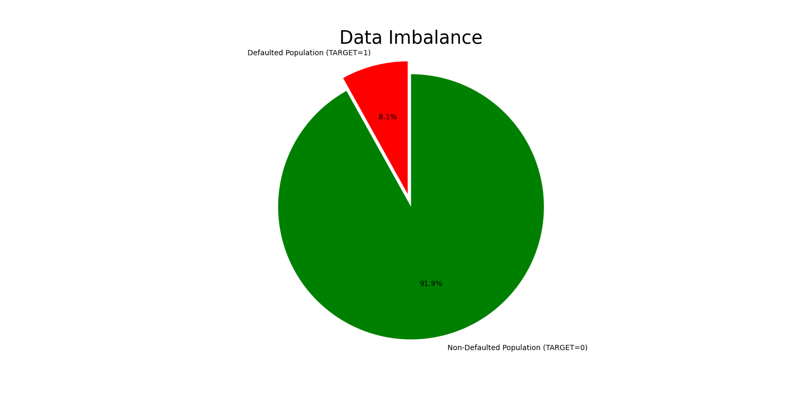

## Data Distributions

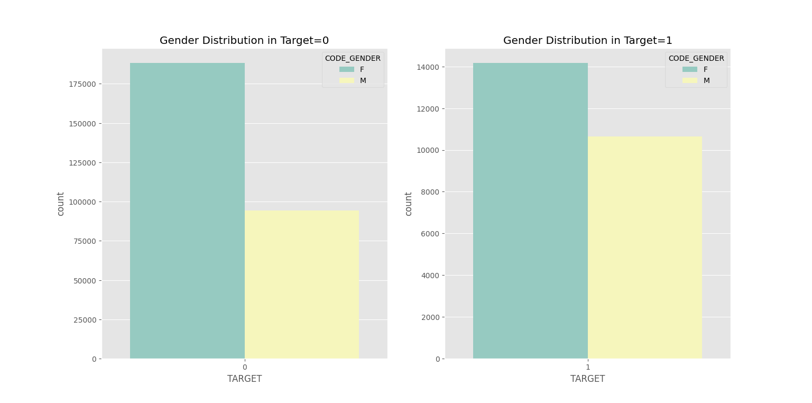

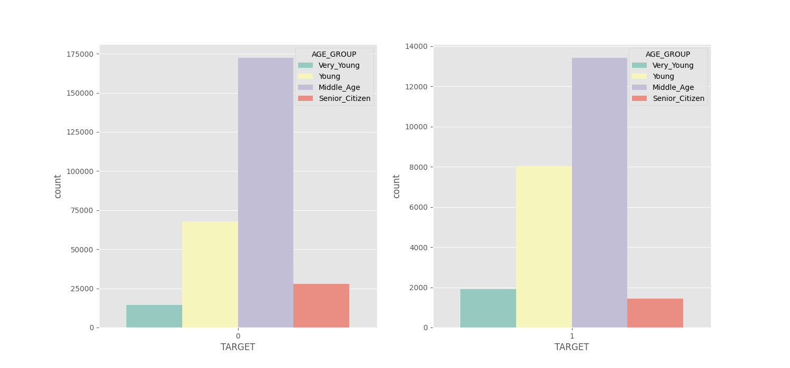

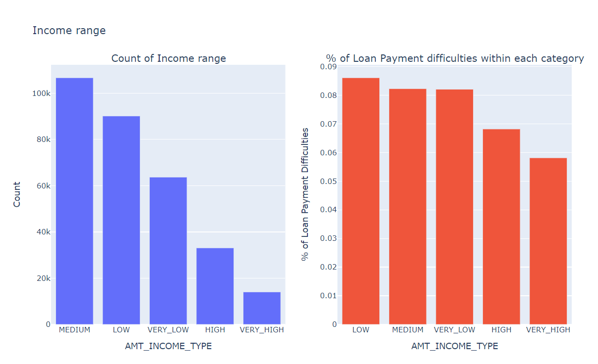

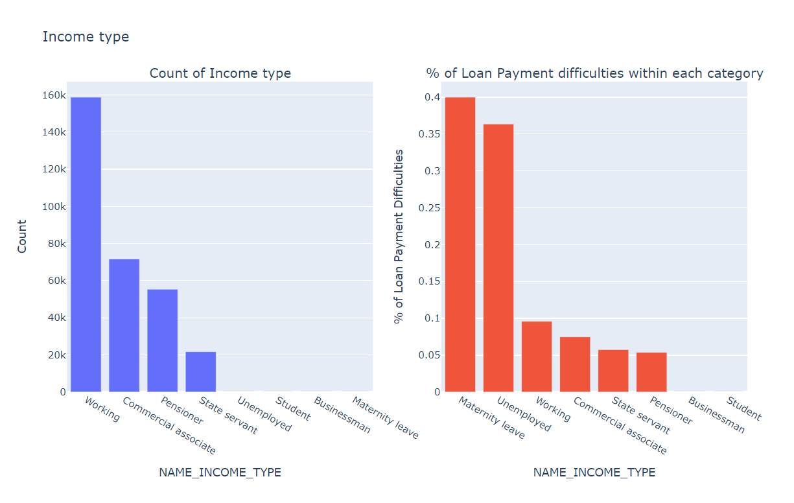

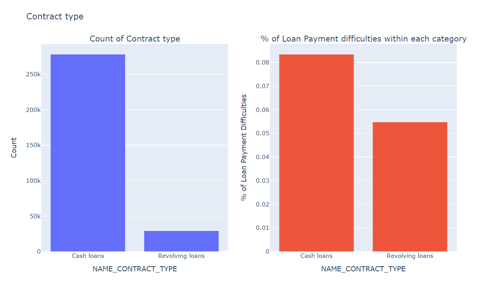

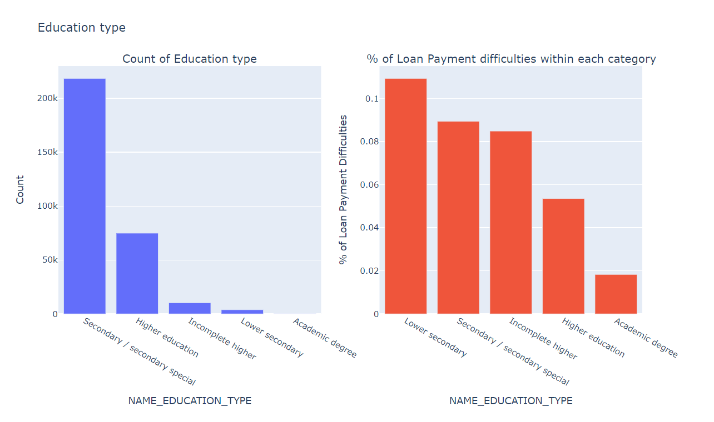

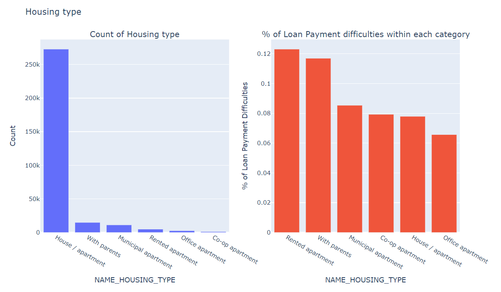

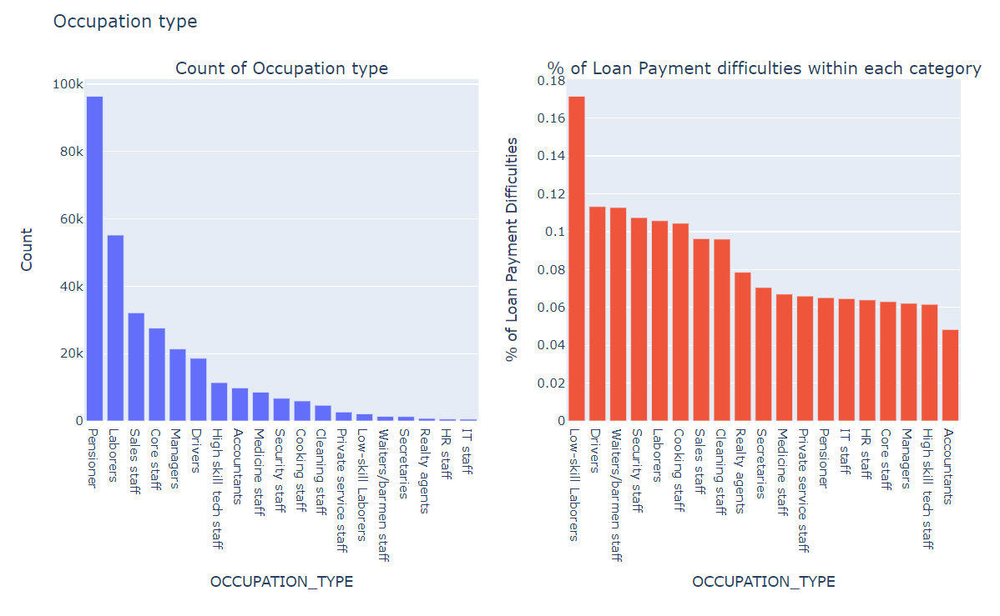

## Correlation Matrices

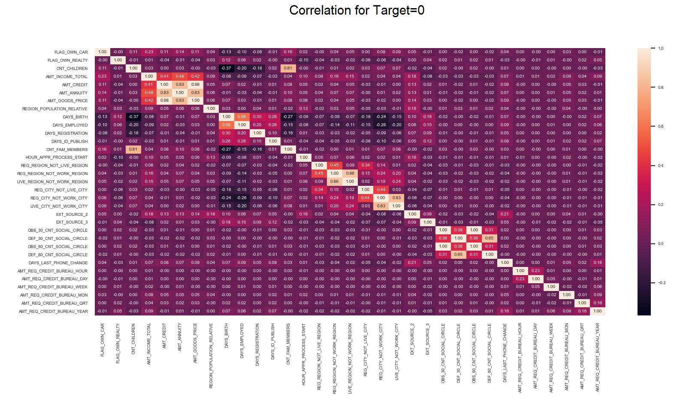

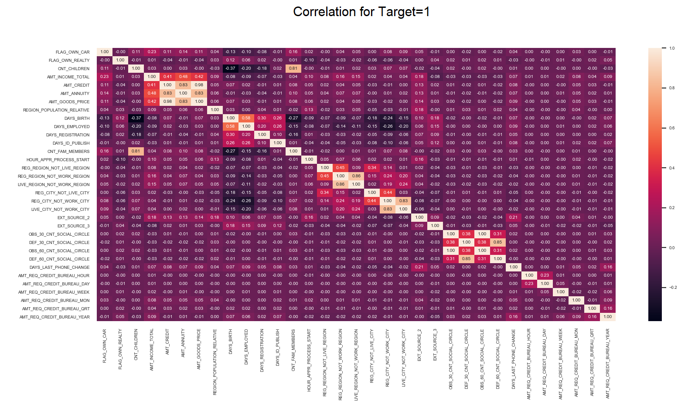

This Repo is for Marketing Demo tasks.

https://github.com/mekongsoft/cardfraud-demo

COPYRIGHT@2024 OF FOGHLAIM MEAISIN SOFTWARE, CALGARY, ALBERTA, CANADA.